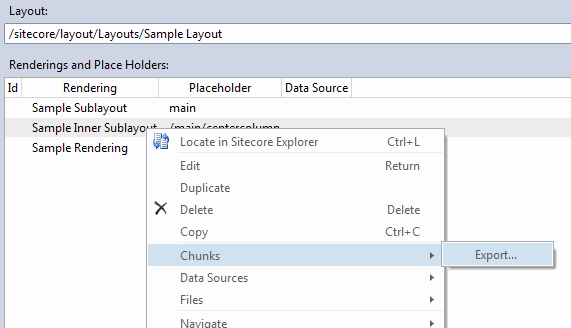
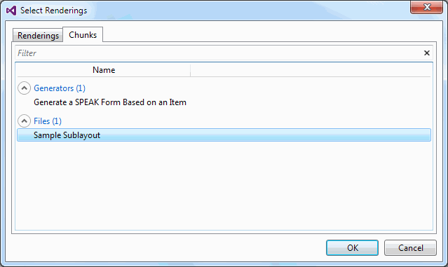

# Rendering Chunks

## Introduction
Rendering Chunks are snippets of renderings that can be inserted into a Layout Definition.

Typically you select a number of renderings in a layout and export them into a file. Later you can insert this chunk of renderings into another layout.

Rendering Chunks can also be generated dynamically by code. For instance a Rendering Chunk could accept an item an generate a form for the item using existing renderings.

## Export a rendering chunk
To export a chunk of renderings, select a number of renderings in the Layout Designer.



Then enter the name of the new chunk. It will get saved to 
````
c:\users\[You]\AppData\Sitecore\Sitecore.Rocks\RenderingChunks
````

## Inserting a rendering chunk
To insert a rendering chunk, click the Add Rendering button and select the Chunks tab.


 
## Implementing a Rendering Chunk Generator

Rendering Chunk Generators allows you to implement dynamic chunks based on parameters or context.

A generator must implement the  ````IRenderingChunk```` interface and be marked with the attribute ````[Export(typeof(IRenderingChunk))]````. Alternatively it can inherit from the RenderingChunkBase class.

A skeleton implementation could look like this:

````

public class FileBasedRenderingChunk : RenderingChunkBase
{
  public FileBasedRenderingChunk(string fileName)
  {
    this.FileName = fileName;
    this.Group = "Files";
  }

  public string FileName { get; private set; }

  public override void GetRenderings(IRenderingContainer renderingContainer, Action<IEnumerable<RenderingItem>> completed)
  {
	// your code here
  } 
}

````
 
 