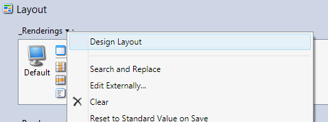

# Versioned Layouts

## Introduction
Sitecore CMS 8 introduces versioned layouts by adding the field __Final Layout to every item. This field is versioned. 

Sitecore Rocks does you to edit the __Final Layout field.

## Editing the versioned layout
To edit the __Final Layout field, open the Item Editor and make sure Standard Fields are visible.

Select the language and version of the item where you want to set the layout.

Click the drop-down arrow on the __Final Layout label and select Design Layout.

This will edit the layout in the currently selected language and version.  