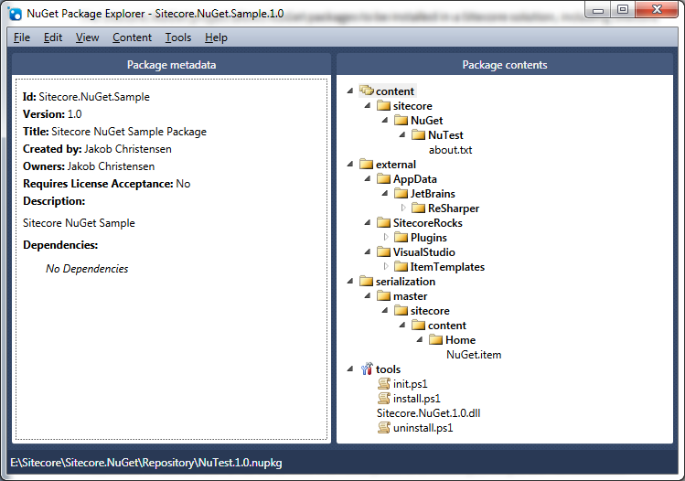

#Sitecore NuGet

Sitecore.NuGet allows NuGet packages to be installed in a Sitecore solution, including Sitecore items.

A Sitecore NuGet package that contains items requires the Sitecore Rocks Hard Rock web service installed on server and that the Visual Project has been connected to the Sitecore installation.

Download the [empty package](http://nuget.org/List/Packages/Sitecore.NuGet.Sample) from NuGet Gallery.

 
## Conventions
A Sitecore.NuGet package is a standard NuGet package with additional conventions. Everything that is possible in NuGet is also possible in a Sitecore.NuGet package.

### Tools folder
The /tools folder must contain the files init.ps1, install.ps1, uninstall.ps1 and Sitecore.NuGet.1.0.dll. These files are executed when the package is installed and uninstalled. 
The Sitecore.NuGet.1.0.dll contains additional PowerShell commands.

### Command Description
Install-AppData	
Copies files to the current user’s AppData/Local folder

Install-Items
Copies items to the current Sitecore installation

Install-ItemTemplates
Installs new Visual Studio Item templates

Install-ProgramFiles
Copies files to the Program Files folder (Program Files (X86) folder on 64-bit machines)

Install-RocksPlugin
Install a new Sitecore Rocks plugin

### Content folder
The /content must contain a file otherwise the install.ps1 and uninstall.ps1 scripts are not executed.
As a convention, the /content/sitecore/NuGet/<package name>/about.txt file must contain a description of the package, including copyright information.

### Serialization folder
The /serialization folder is a Sitecore.NuGet specific folder. It contains Sitecore serialization files that will be installed in the Sitecore solution.
The names of the first level subfolders are the database. For instance:
/serialization/master/sitecore/content/Home/MyItem.item
installs the MyItem item in the master database under /sitecore/content/Home.

### External folder
The /external folder is a Sitecore.NuGet specific folder. It contains files that installed externally to the Sitecore solution.
The /external/AppData contains files for the current user’s AppData\Local folder.
The /external/SitecoreRocks/Plugins folder is copied to the Sitecore Rocks plugins folder.
The /external/VisualStudio/ItemTemplates folder is copied to the Sitecore Rocks Visual Studio Item Templates folder.

## Installing items
The process of installing items is fairly complicated, since Sitecore.NuGet has to locate the Sitecore web site and upload each file to the web site.

### Connection
Sitecore.NuGet first determines the currently active project in Visual Studio. When using the NuGet Console this is provided by NuGet. When using the Package Management dialog, the currently active project in the Solution Explorer is used. If no project is found, an exception is thrown.

Sitecore.NuGet then reads the Sitecore Rocks .sitecore file from the project. If the file is not found, an exception is thrown. The .sitecore file contains connection information (server name and user name).

Next Sitecore.NuGet scans the connections files for a match for server name and user name to obtain a password. If not found, an exception is thrown.

### Deserialization
For each file in the /serialization folder, Sitecore.NuGet uploads the file to Packages.DeserializeItem method through the Sitecore Rocks Hard Rock web service. The file is stored in the Sitecore serialization folder in a location that matches the location in the Sitecore.NuGet Package. The file is then deserialized using standard Sitecore functionality. Please notice that any existing items are overwritten as Sitecore.NuGet uses the Revert Item functionality.

Please notice that the deserialization functionality does not use the file path of the serialization file, but uses the path information inside the file, to determine the location of the file. Therefore be careful to put the serialization files in the correct location in the Sitecore.NuGet package.

## Uninstall
Sitecore.NuGet tries to keep track of what is installed, so that a package can be uninstalled.

### Files
Sitecore.NuGet stores information about each file that is copied. This information is stored in the <project root>\packages\<package name>\tools\install.log file. 

When the package is uninstalled, each file in this file is deleted.

### Items
Sitecore.NuGet stores information about each item that is copied to the Sitecore installation. This information is stored in the <project root>\packages\<package name>\tools\install.item.log file. 
When the package is uninstalled, every item is deleted, regardless of whether it has been modified or not or if subitems has been created.

## Copying Sitecore.NuGet.1.0.dll
When installing or uninstalling a package the Sitecore.NuGet.1.0.dll is first copied to the Windows temp folder. It is then loaded into the current PowerShell session from that location. 
The reason for this is that PowerShell locks the assembly until Visual Studio is restarted. By copying the assembly, the package can be uninstalled without errors.
