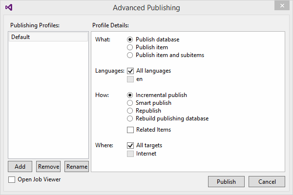

# Advanced Publishing Dialog

The Advanced Publishing Dialog allows you to use all the publishing options in Sitecore - including the Sitecore CMS 8 options: Related Items.

To open the Advanced Publishing dialog, right-click in the Suitecore Explorer, and select Tools | Publishing | Advanced Piblishing.

## Profiles

You can set up profiles for often used settings.

To add a new profile, click the Add button and enter a name for the profile. The profile will contain the currently selected options. 