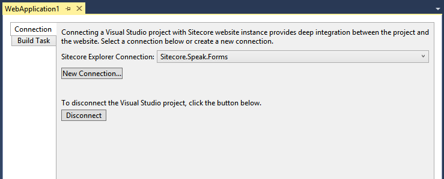
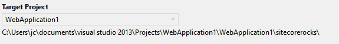
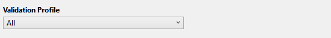
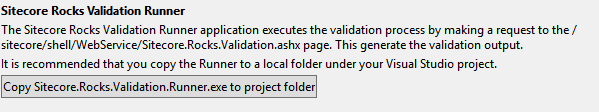
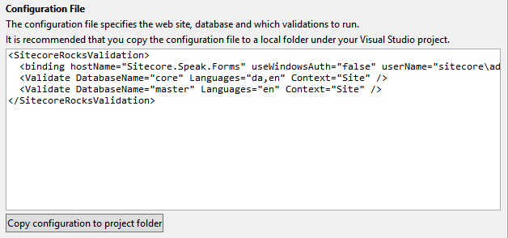
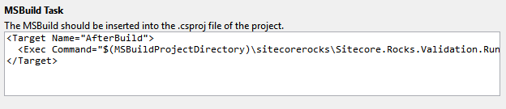

# Run Validations on Build or in a CI environment

## Introduction
Sitecore Rocks contains a number of validation rules that check the quality of the site. As of this writing 70 validation rules are supported.

These validation rules can be executed as part of the Visual Studio Build process or in a CI environment.

This document describes how to configure this.

## Prerequisites
The Sitecore Rocks server component must be installed in the web site.

File | Location
---- | --------
Sitecore.Rocks.Server.Core.dll | /bin
Sitecore.Rocks.Server.dll | /bin
Sitecore.Rocks.Server.Validation.dll | /bin
Sitecore.Rocks.Validation.ashx | /sitecore/shell/WebService

## Configure Visual Studio Build task
To enable validation on build in Visual Studio, you must:

1. Have Sitecore Rocks server components installed.
2. Copy the Sitecore Rocks Validation Runner to a local folder under the Visual Studio project.
3. Place a configuration file in the local folder.
4. Insert a new build task snippet into the Visual Studio project .csproj file

### Make a link between Visual Studio project and a connection in the Sitecore Explorer

You can skip this part, if you have already made a link.

The Visual Studio project must be linked to a connection in Sitecore Explorer.

To make a link, right-click the project in Solution Explorer and select Sitecore | Project Properties. This will open the Project Properties window.

Choose an existing connection or create a new connection. Close the window and make sure that the link is working by right-clicking the project in the Solution Explorer and check that new options have appeared in the Sitecore menu.

### Create a Build Task

Open the Project Properties window by right-clicking the project in the Solution Explorer and selecting Sitecore | Project Properties, then select the Build Task tab.

The first part indicates the project. This should show the current project and the target folder.

Next part shows the Validation profile.

This is a list of all the profiles in the Validation management window. You can configure profiles by right-clicking a connection in the Sitecore Explorer and selecting Manage, then select the Validation tab. In the Validation tab select the Edit button.
 
The third part allows you to copy the validation runner executable to a local folder in the project folder. 

The runner is executed by the Build Task. It makes a request to the /sitecore/shell/WebService/Sitecore.Rocks.Validation.ashx web page and formats the response. You should click the button to copy the runner.

The forth part shows the content of the configuration file that should be placed next to the runner.

You should click the button to copy the configuration file.
The last part is the snippet that should be inserted into the projects .csproj file.
 

You should copy this snippet and paste it into the .csproj file.

### Building

When the developer starts a build of the Visual Studio project, the build engine starts the build task that was inserted into the .csproj file. This task execute the Sitecore.Rocks.Validation.Runner.exe, which loads and parses the configuration file.

It then makes a request to the /sitecore/shell/WebService/Sitecore.Rocks.Validation.ashx web page, which runs the validations. The response is then parsed and formatted, so that Visual Studio can show validation warning and errors in the Output and Error List windows.

