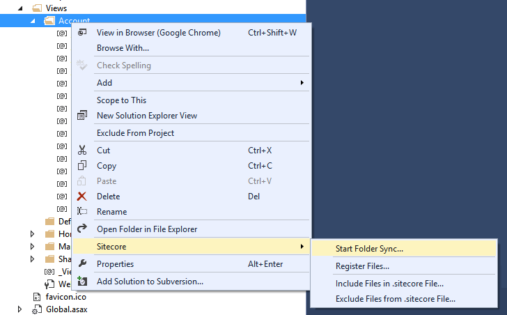
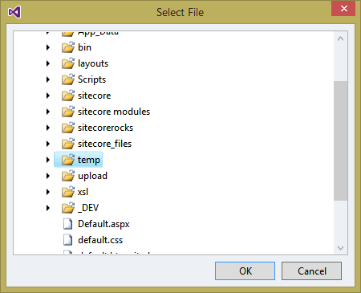
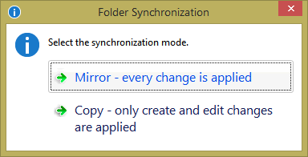
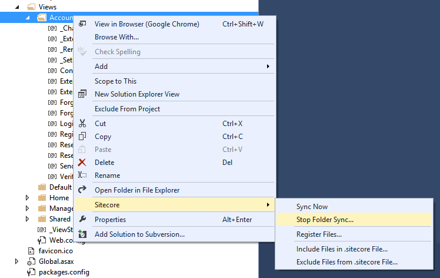
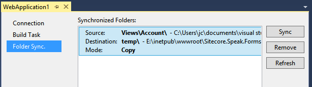
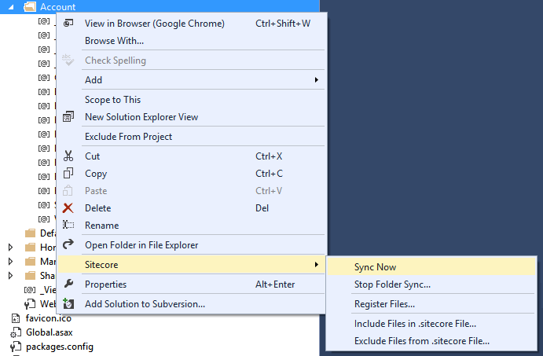

# Folder Synchronization

Folder synchronization allows you to automatically synchronize the contents of one folder with another.

This is useful when working in Visual Studio where the Visual Studio project is located in a different folder than the website. Normally this requires you to execute a script that copies any changed files from the project to the website folder.

With Folder Synchronization any changed file is copied as soon as the file is saved.

This feature is heavily inspired by the CopySauce utility.

Folder Synchronization is only supported in Sitecore Rocks Visual Studio.

## How it works
In Sitecore Rocks you specify which folders in the Visual Studio project should be synchronized and where to copy changed files. You can specify a file mask and if changes are Copied or Mirrored.

## Copy modes
Folder Synchronization operates with two modes: Copy and Mirror.

In Mirror mode any change (update, create, rename or delete) is applied to the destination folder.

In Copy mode creates and updates are applied. Renames does not delete the old file and Deletes are not applied. This is a non-destructive mode.  
 
## Start synchronizing
The Visual Studio project must be connected to a Sitecore Explorer connection.

To synchronize a folder, select a folder in the Solution Explorer and select Sitecore | Start Folder Sync in the context menu.

Next select the destination folder in the Sitecore website

And finally select the mode.

Done.

## Stop synchronizing a folder

To stop synchronizing a folder, select the folder in the Solution Explorer and select Sitecore | Stop Folder Sync in the context menu.  

Alternative you can open the Project Properties window by opening the context menu for the Visual Studio project and selecting Sitecore | Project Properties. Open the Folder Sync tab. Select the folder, you want stop stop synchronizing and click Remove.

## Synchronize folders
You can synchronize folders explicitly by selecting Sitecore | Sync Now in the Solution Explorer context menu for a folder. The folder has to be configured for Folder Synchronization first.

In Mirror mode, this will execute a shell command like this:

`robocopy <source> <target> /mir /njh /njs /ndl /nc /ns /np`

In Copy mode, this will execute the following shell command:   

`xcopy <source>\*.* <target> /e /d /i /y`

Synchronizing folder can also the executed from Folder Sync tab in Project Properties.

## Synchronize build output
You can also synchronize the output assembly when a project has been built to the /bin folder of the website. Please notice that resources that are marked with Copy to Output Folder in Visual Studio are not included - only the output assembly is copied.